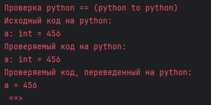

# MeaningTree Testing Framework

Система тестирования MeaningTree — это специализированный фреймворк на базе JUnit Jupiter, предназначенный для проверки корректности преобразования кода между языками Python, Java и C++ через промежуточное смысловое дерево. Тестовые спецификации хранятся в YAML-подобных файлах с расширением `.test` и автоматически разбираются и выполняются динамически.

---

## Основные компоненты

- **LanguageTests** — отвечает за инициализацию трансляторов, загрузку тестов и динамическое создание тест-кейсов.  
- **TestsParser** — разбирает содержимое `.test` файлов, выделяя группы (`group`) и кейсы (`case`).  
- **TestConfig / TestLanguageConfig** — хранят настройки для каждого языка (например, чувствительность к отступам).  
- **CodeFormatter** — нормализует формат кода для корректного сравнения.  
- **TestCombinator** — генерирует все возможные пары «исходный → целевой» языков для каждого кейса.

---

## Структура тестовых данных и механизмы комбинирования

Файлы формата `.test` организованы иерархически:

- `group` — объединяет связанные по функциональности тестовые случаи.
- `case` — конкретный сценарий проверки внутри группы.
- `<language_name>` — блоки кода для одного языка в рамках кейса, различаются по типам:
  - **default** — обычный код без специальных пометок.
  - **main** — основной (эталонный) блок, задаёт направление трансляции.
  - **alt** — альтернативные реализации одного и того же логического фрагмента.
  - **isolated** — изолированные фрагменты для проверки специфичных конструкций, не подлежащих межъязыковому конвертированию.

### Генерация тестов (TestCombinator)

1. Если в `TestCase` присутствует блок `main`, генерируются пары по схеме  
   ```
   (main → target) == target
   ```
   После чего происходит проверека одинаковости полученного кода.
   
   Пример:
   ```yaml
   group: SimpleStatements
        case: VariableDeclaration
            main python:
                a = 456
            java:
                int a = 456;
            c++:
                int a = 456;
   ```
   В данном случае будут созданы 3 теста (`python` -> `java`, `python` -> `c++`) с последующей проверой на то,
   соотвествуют ли полученные коды на `java` и `c++` исходно-заданным.

2. Если блока `main` нет, создаются все допустимые перестановки языков по схеме  
   ```
   source == (target → source)
   ```
   После чего происходит проверека одинаковости полученного кода.
   Пример:
   ```yaml
   group: SimpleStatements
        case: VariableDeclaration
            python:
                a = 456
            java:
                int a = 456;
            c++:
                int a = 456;
   ```
   В данном случае будут созданы 6 тестов (`python` -> `java`, `python` -> `c++`, `java` -> `python`, `java` -> `c++`, `c++` -> `java`, `c++` -> `python`) с последующей проверой на то, соотвествуют ли полученные коды исходного заданным.

3. `isolated`-блоки

    Язык, отмечанный как `isolated`, не допускает преобразований в другой язык.
    Пример:
   ```yaml
   group: SimpleStatements
        case: VariableDeclaration
            python:
                a = 456
            isolated java:
                int a = 456;
            c++:
                int a = 456;
   ```
   В данном случае будут созданы 4 теста (`python` -> `java`, `python` -> `c++`, `c++` -> `java`, `c++` -> `python`),
   ни один из которых не допускает преобразовния `java` в какой-либо другой язык.

4. Исключаются бессмысленные сочетания:
   - преобразования между двумя `alt` блоками;
   - трансляции `isolated` блоков без участия `main`.

### Нормализация и сравнение кода (CodeFormatter)

- **Python**: сохраняется относительная структура отступов, удаляется только базовый уровень, выровненный по первой строке.
- **Java/C++**: нормализуются все отступы, пробелы в начале и конце строк убираются.
- **Табы → пробелы**: табуляции конвертируются в 4 пробела.

    Такой подход гарантирует, что при сравнении учитывается лишь семантическая эквивалентность кода, а не стилистические различия.
---

## Провалившиеся тесты

В случае провала тестов, пользователю будет показана ошибка, похожая на следующую:


В ней описана следующая информация:
- Исходный код на python: код, который было необходимо сконвертировать;
- Проверяемый код на python: код, который ожидается в результате конвертации;
- Проверяемый код, переведенный на python: код, полученный в результате перевода исходного кода.

## Пример формата теста

```yaml
group: LiteralsTest
    case: Identifier
        python:
            simple_ident
        java:
            simple_ident;
        c++:
            simple_ident;
```

- `group` — объединяет кейсы по теме (здесь проверка литералов).  
- `case` — конкретная проверка (например, идентификатор).  
- Далее указываются блоки кода на разных языках. Отмеченный как `python` блок считается «эталоном», остальные — целевыми реализациями.

---

## Примеры тест-кейсов

### 1. Проверка числовых литералов

```yaml
group: SimpleExpressionsTest
    case: PlusOp
        python:
            a + 5
        java:
            a + 5;
        c++:
            a + 5;
```

Сценарий: система трансформирует выражение `a + 5` в промежуточное дерево и обратно в Java/C++, затем сравнивает с ожидаемым `a + 5;`.

### 2. Проверка объявления переменной

```yaml
group: SimpleStatements
    case: VariableDeclaration
        python:
            a: int = 456
        java:
            int a = 456;
        c++:
            int a = 456;
```

Сценарий: тест проверяет создание переменной с типом и значением во всех трёх языках.